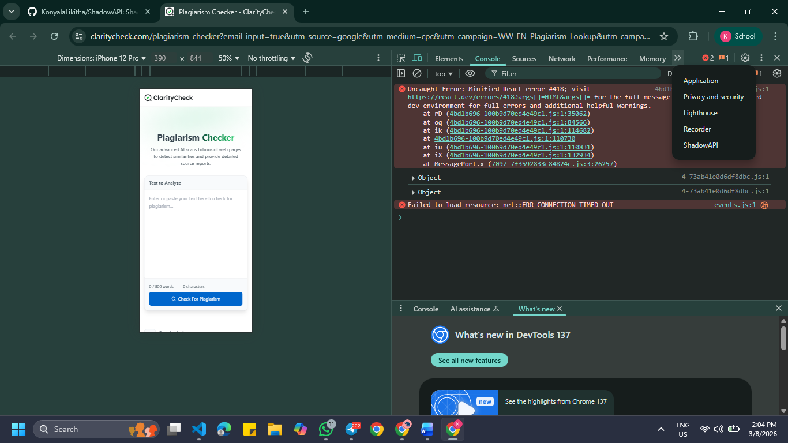
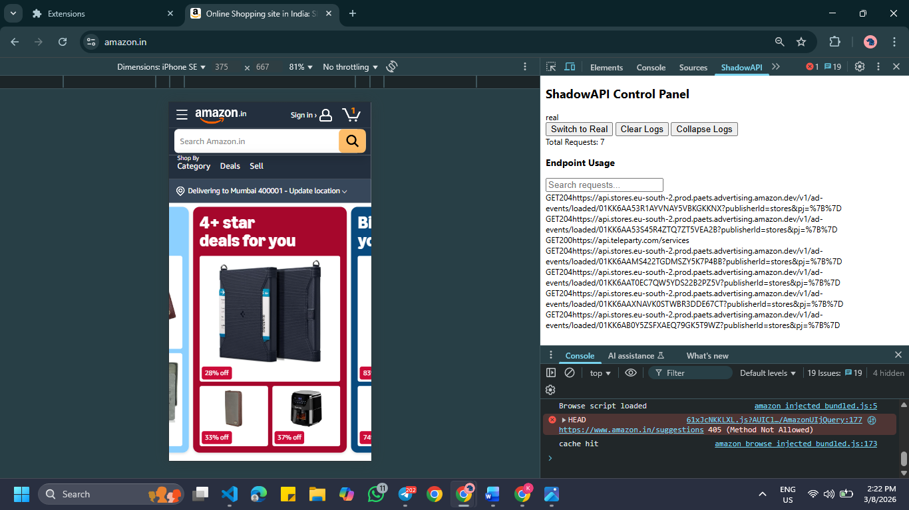
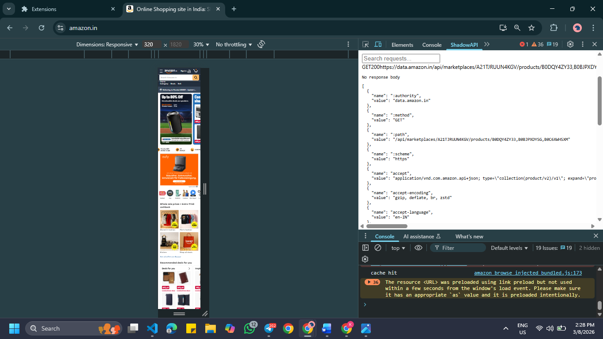

# ShadowAPI

**Remove backend dependency during development.**

ShadowAPI is an open-source development gateway that generates realistic mock servers from API contracts and seamlessly switches to real backends as they become available.

## Why ShadowAPI?

- **Parallel Development**: Frontend teams build without waiting for backend
- **Contract-First**: Generate mocks from OpenAPI/Swagger specs
- **Seamless Switching**: Proxy to real backend when ready, same endpoint URL
- **Smart Fallback**: Missing endpoints auto-fallback to mocks
- **Local-First**: No cloud dependencies, reproducible setups

Perfect for student projects, hackathons, CI environments, and open-source contributors.

## Quick Start

```bash
# Install
npm install -g shadowapi

# Initialize
shadowapi init

# Start mock server
shadowapi start --contract api-spec.yaml

# Connect real backend (when ready)
shadowapi connect --backend http://localhost:8080
```

## Demo Example

ShadowAPI includes a small frontend demo that generates API requests so you can easily test the DevTools extension.

### Run the Demo

1. Open the demo file: examples/demo-app/index.html
2. Click **Load Users** to generate an API request.
3. Open **Chrome DevTools**: F12 → ShadowAPI Tab
4. The request will appear inside the **ShadowAPI Control Panel**.

This demo is included to make testing the DevTools extension simple for contributors and developers.

## Features

- ✅ Dynamic mock generation from API contracts
- ✅ Stateful request/response simulation
- ✅ Automatic proxy forwarding
- ✅ Gradual backend integration
- ✅ Request logging & inspection
- ✅ Chrome DevTools extension
## DevTools Extension

ShadowAPI provides a Chrome DevTools extension that allows developers to inspect API requests in real time.

### Features

- API request monitoring
- Mock / Real backend toggle
- Request search and filtering
- Expandable response viewer
- Request header inspection
- Request counter
- Clear and collapse logs

### Screenshots

#### DevTools Panel


#### Request Logs


#### Response Viewer

## Project Status

🚧 **Active Development** — Week 1/4

Current milestone: Core infrastructure & basic mock server

## Architecture

```
Frontend → ShadowAPI Gateway → Mock Engine (fallback)
                            ↓
                         Real Backend (when available)
```

## Repository Structure

```
shadowapi/
├── engine/      # Mock data generation & state
├── gateway/     # Proxy & routing logic
├── cli/         # Command-line interface
├── extension/   # Chrome DevTools panel
├── examples/    # Sample projects
└── docs/        # Documentation
```
## Example Frontend Demo

ShadowAPI includes a small demo frontend that generates API requests so the DevTools extension can inspect them.

### Location

```
examples/demo-app/
```

### How to Run the Demo

1. Open the demo page in your browser:

```
examples/demo-app/index.html
```

2. Open Chrome DevTools:

```
F12 → ShadowAPI tab
```

3. Click **Load Users** on the demo page.

This will trigger an API request:

```
GET https://jsonplaceholder.typicode.com/users
```

4. The request will appear inside the **ShadowAPI DevTools panel**, where you can inspect:

* request URL
* HTTP method
* response status
* response body
* headers

### Purpose

The demo project is provided to:

* test the DevTools extension
* generate API requests
* demonstrate how ShadowAPI inspects network traffic

## Contributing

We welcome contributions! See [CONTRIBUTING.md](CONTRIBUTING.md) for guidelines.

## License

MIT License - see [LICENSE](LICENSE)

## Roadmap

- [x] Project setup
- [ ] Basic mock server
- [ ] Proxy forwarding
- [ ] DevTools extension
- [ ] Full documentation

---

**Built for developers who ship fast.**
