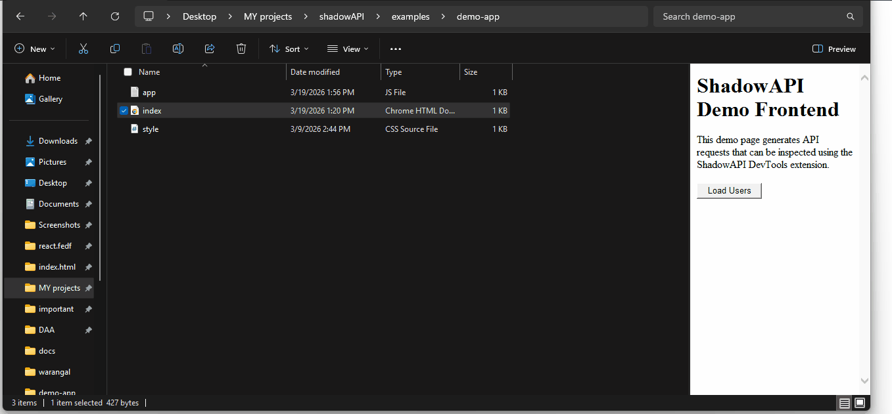

# ShadowAPI

ShadowAPI is an open-source development gateway that enables frontend teams to work without waiting for backend APIs.

It generates mock APIs from contracts and seamlessly switches to real backend services when available.

---

## Demo

Below is a demonstration of the ShadowAPI DevTools extension.



---

## Why ShadowAPI?

* Parallel frontend and backend development
* Contract-first API workflow
* Automatic fallback to mock APIs
* Seamless switching to real backend
* Local-first development (no cloud dependency)

---

## Features

* Dynamic mock API generation
* Stateful request/response simulation
* Proxy forwarding to real backend
* Automatic fallback handling
* API request logging and inspection
* Chrome DevTools extension

---

## Quick Start

```bash
npm install -g shadowapi

shadowapi init

shadowapi start --contract api-spec.yaml

shadowapi connect --backend http://localhost:8080
```

---

## Example Demo

A sample frontend project is included:

```bash
examples/demo-app/index.html
```

Steps:

1. Open the demo page
2. Click "Load Users"
3. Open DevTools → ShadowAPI tab
4. Inspect API requests

---

## DevTools Guide

Detailed usage instructions:

```
docs/devtools-guide.md
```

---

## Example Documentation

```
docs/example-usage.md
```

---

## Project Structure

```
shadowapi/
 ├ engine/
 ├ gateway/
 ├ cli/
 ├ extension/
 ├ examples/
 ├ docs/
 ├ CONTRIBUTING.md
 ├ LICENSE
 └ README.md
```

---

## Project Status

Active Development — Week 2/4

Current focus: Mock server and DevTools integration

---

## Roadmap

* Mock engine improvements
* Gateway proxy integration
* DevTools enhancements
* CLI improvements
* Documentation completion

---

## Contributing

Contributions are welcome.

See:

```
CONTRIBUTING.md
```

---

## License

MIT License
