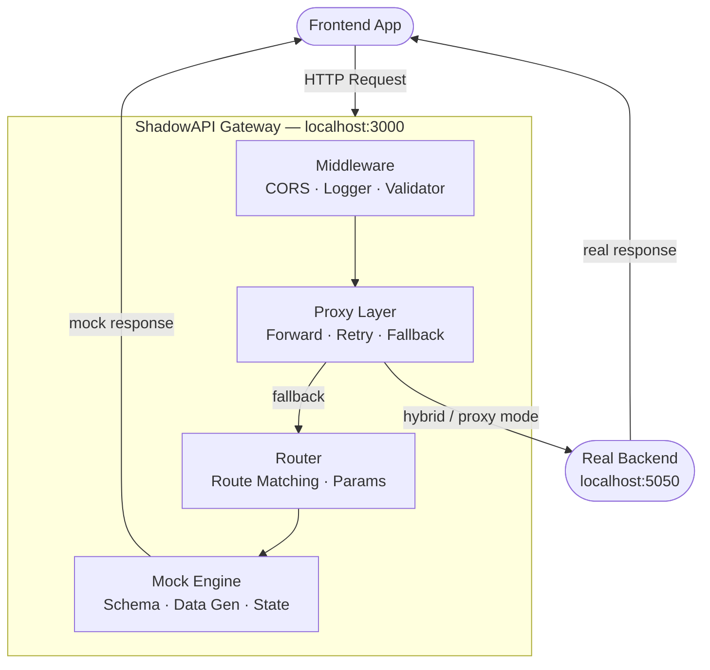

# ShadowAPI

<p align="center">
  
</p>

<p align="center"><b>No backend? No problem.</b></p>

> A local-first development gateway that lets frontend teams build against realistic mock APIs — and seamlessly switch to a real backend the moment it becomes available.


---

## What is ShadowAPI?

ShadowAPI is an open-source developer tool that eliminates the most common bottleneck in modern web development — **frontend teams waiting on backend APIs**.

Instead of blocking progress, ShadowAPI sits between your frontend and backend as a local gateway. It serves realistic mock responses when no backend exists, and automatically switches to the real backend the moment one is available — with zero code changes required.

The switch is live, seamless, and visible directly in Chrome DevTools.

---

## Problem Statement

In most development teams, frontend and backend work is sequential:

1. Backend team designs and builds APIs
2. Frontend team waits
3. Frontend team finally starts building

This creates wasted time, blocked sprints, and misaligned expectations. Existing solutions like Postman mocks or hardcoded JSON files are static, disconnected from real contracts, and require manual switching when the backend is ready.

**ShadowAPI solves this by making mock-to-real switching automatic, contract-driven, and developer-friendly.**

---

## Key Features

- **Dynamic mock API generation** — realistic data generated from schema definitions, not hardcoded JSON
- **Stateful simulation** — POST, PUT, DELETE operations update in-memory state across requests
- **Seamless proxy switching** — hybrid mode tries the real backend first, falls back to mock automatically
- **Live source labeling** — every response is tagged with `x-shadowapi-source: mock` or `x-shadowapi-source: real`
- **Error simulation** — intentional 500 errors and configurable failure scenarios for resilience testing
- **Chrome DevTools extension** — inspect every API request, see MOCK vs REAL labels, toggle modes
- **Clean CLI** — `init`, `start`, `status`, `connect`, `reconnect` commands with readable output
- **Contract-first** — routes defined in `openapi.yaml` and `schema.json`
- **Zero cloud dependency** — runs entirely on localhost

---

## Tech Stack

| Layer | Technology |
|---|---|
| Gateway & Proxy | Node.js, Express |
| Mock Engine | Node.js (custom schema parser + data generator) |
| CLI | Node.js (custom command runner) |
| DevTools Extension | Chrome Extensions API (Manifest V3) |
| Testing | Jest, Supertest |
| Config | JSON, YAML |

---

## System Architecture



### Request Flow by Mode

| Mode | Behaviour |
|---|---|
| `mock` | All requests served by mock engine |
| `proxy` | All requests forwarded to real backend |
| `hybrid` | Tries real backend first — falls back to mock on failure or 404 |

### End-to-End Flow

```
1. Developer runs: shadowapi start --mode hybrid
2. Frontend makes a request to http://localhost:3000/api/users
3. Gateway receives the request
4. Middleware runs: CORS, logging, validation
5. Proxy checks if real backend is available
   ├── Backend reachable → forwards request → returns real response (x-shadowapi-source: real)
   └── Backend unreachable → falls back to Mock Engine → returns mock response (x-shadowapi-source: mock)
6. Response is sent to frontend
7. Chrome DevTools extension shows MOCK or REAL label for every request
```

---

## Project Structure

```
shadowapi/
├── engine/               # Mock engine — schema parsing, data generation, state
│   ├── index.js          # Core request handler
│   ├── dataGenerator.js  # Realistic fake data generation
│   ├── stateStore.js     # In-memory state for POST/PUT/DELETE
│   ├── errorSimulation.js# Configurable error injection
│   ├── responseValidator.js
│   └── schema.json       # Route + field definitions
│
├── gateway/              # Express gateway — routing, proxy, middleware
│   ├── server.js         # Server bootstrap
│   ├── router.js         # Route registration + mock dispatch
│   ├── proxy.js          # Proxy forwarding + fallback logic
│   ├── middleware.js      # CORS, logger, validator setup
│   ├── logger.js         # Color-coded request logger
│   ├── errorHandler.js   # Global error handling
│   ├── validator.js      # Request validation
│   ├── backendChecker.js # Backend health probe
│   ├── responseValidator.js # Real vs mock shape comparison
│   ├── statusCodes.js    # HTTP status code constants
│   ├── routes.config.js  # Route definitions
│   └── tests/            # Jest + Supertest integration tests
│
├── cli/                  # CLI — commands, config, UX
│   ├── index.js          # Entry point
│   ├── logger.js         # CLI output formatting
│   └── commands/
│       ├── init.js       # shadowapi init
│       ├── start.js      # shadowapi start
│       ├── status.js     # shadowapi status
│       ├── connect.js    # shadowapi connect
│       └── reconnect.js  # shadowapi reconnect
│
├── extension/            # Chrome DevTools extension
│   ├── manifest.json
│   ├── devtools.html/js  # DevTools panel registration
│   ├── panel.html/js     # Request inspector UI
│   └── styles.css
│
├── examples/
│   └── demo-app/         # Sample frontend for demo
│
├── docs/
│   ├── architecture.md   # System architecture + Mermaid diagrams
│   ├── devtools-guide.md
│   └── example-usage.md
│
├── shadowapi.config.json
├── openapi.yaml
├── CHANGELOG.md
├── CONTRIBUTING.md
└── README.md
```

---

## Installation

**Prerequisites:** Node.js v16+, npm, Google Chrome

```bash
# 1. Clone the repository
git clone https://github.com/KonyalaLikitha/ShadowAPI.git
cd ShadowAPI

# 2. Install dependencies
npm install

# 3. Link CLI globally
npm link
```

---

## Quick Start

### Step 1 — Initialize

```bash
shadowapi init
```

Creates `shadowapi.config.json` and `openapi.yaml` in your project.

### Step 2 — Start the gateway

```bash
shadowapi start --mode hybrid
```

Expected output:

```
ShadowAPI: Starting ShadowAPI...
✓ ShadowAPI: Configuration loaded
ShadowAPI: Mode: hybrid
ShadowAPI: Behavior: backend first, fallback to mock
ShadowAPI: Server URL: http://localhost:3000
ShadowAPI: Try this URL: http://localhost:3000/api/hello
🚀 ShadowAPI Gateway running on http://localhost:3000 [hybrid]
```

### Step 3 — Test mock responses

```bash
curl http://localhost:3000/api/users
curl http://localhost:3000/api/users/1
curl http://localhost:3000/api/hello
curl http://localhost:3000/health
```

### Step 4 — Connect a real backend

```bash
shadowapi connect http://localhost:5050
```

Or start a quick test backend:

```bash
node -e "require('http').createServer((req,res)=>{res.setHeader('Content-Type','application/json');res.end(JSON.stringify({users:[{id:99,name:'Real User'}]}))}).listen(5050)"
```

Refresh your request — the response now comes from the real backend automatically.

### Step 5 — Check status

```bash
shadowapi status      # shows mode, backend, contract info
shadowapi reconnect   # checks if backend is reachable
```

---

## CLI Commands

| Command | Description |
|---|---|
| `shadowapi init` | Initialize config and openapi spec |
| `shadowapi start` | Start the gateway |
| `shadowapi start --mode mock` | Start in mock-only mode |
| `shadowapi start --mode hybrid` | Start in hybrid mode |
| `shadowapi start --port 4000` | Start on custom port |
| `shadowapi connect <url>` | Set backend URL |
| `shadowapi status` | Show current config and backend health |
| `shadowapi reconnect` | Re-probe backend reachability |
| `shadowapi --help` | Show all commands |

---

## API Endpoints

| Endpoint | Method | Description |
|---|---|---|
| `/api/hello` | GET | Health check — always returns mock |
| `/api/users` | GET | List all users |
| `/api/users/:id` | GET | Get user by ID |
| `/api/users` | POST | Create user (updates state) |
| `/api/users/:id` | PUT | Update user |
| `/api/users/:id` | DELETE | Delete user (204) |
| `/api/products` | GET | List all products |
| `/api/products/:id` | GET | Get product by ID |
| `/api/error` | GET | Simulate 500 error |
| `/health` | GET | Gateway health + proxy stats |
| `/gateway/status` | GET | Backend health + uptime + route count |

---

## Response Headers

Every response from ShadowAPI includes:

| Header | Value | Meaning |
|---|---|---|
| `x-shadowapi-source` | `mock` or `real` | Where the response came from |
| `x-shadowapi-mode` | `mock`, `proxy`, or `hybrid` | Active gateway mode |

These headers power the Chrome DevTools extension's MOCK/REAL labels.

---

## Chrome DevTools Extension

### Install

1. Open Chrome → `chrome://extensions`
2. Enable **Developer Mode**
3. Click **Load unpacked**
4. Select the `extension/` folder

### Features

- Inspect every API request made by the frontend
- See **MOCK** or **REAL** badge on each request
- View request/response headers and body
- Search and filter requests
- Toggle between mock and real mode
- Color-coded by HTTP method and status

---

## Live Switching Demo

This is the core feature of ShadowAPI:

```
# Terminal 1 — start gateway in hybrid mode
shadowapi start --mode hybrid

# Terminal 2 — backend is OFF
curl http://localhost:3000/api/users
→ {"users": [{"id":1,"name":"User1"}]}   ← MOCK

# Terminal 3 — start real backend
node -e "require('http').createServer((req,res)=>{res.setHeader('Content-Type','application/json');res.end(JSON.stringify({users:[{id:99,name:'Real User'}]}))}).listen(5050)"

# Terminal 2 — backend is ON
curl http://localhost:3000/api/users
→ {"users": [{"id":99,"name":"Real User"}]}  ← REAL

# Stop backend (Ctrl+C in Terminal 3)
curl http://localhost:3000/api/users
→ {"users": [{"id":1,"name":"User1"}]}   ← MOCK (auto fallback)
```

Zero config changes. Zero restarts. Fully automatic.

---

## Running Tests

```bash
npm test
```

Runs 22 integration tests covering:

- Mock mode routes (GET, POST, PUT, DELETE)
- Dynamic URL params (`/users/:id`)
- `x-shadowapi-source` and `x-shadowapi-mode` headers
- Proxy fallback on backend 404
- Proxy fallback when backend is unreachable
- Real backend forwarding
- Backend health checker
- Response shape validation

---

## Team Contributions

### Member A — Mock Engine
**Folder:** `engine/`

Responsible for building the core data simulation layer that powers all mock responses.

- Schema parsing from `schema.json` and `openapi.yaml`
- Dynamic data generation for users, products, and orders using `dataGenerator.js`
- In-memory state store — POST creates, PUT updates, DELETE removes records across requests
- Error simulation — configurable failure injection for resilience testing (`/api/error`)
- Response validator — compares real backend response shape against mock schema and warns on mismatches
- Full support for GET, POST, PUT, DELETE with realistic field types (string, email, number, boolean)

### Member B — Gateway & Proxy
**Folder:** `gateway/`

Responsible for the signature feature — seamless mock-to-real backend switching.

- Express gateway with auto route registration
- Proxy forwarding to real backend with retry logic (1 retry before fallback)
- Automatic fallback to mock on backend error, timeout, or 404
- `x-shadowapi-source` and `x-shadowapi-mode` headers on every response
- Color-coded request logger showing method, URL, status, source, and latency
- Backend health checker on startup with latency reporting
- `/health` endpoint with proxy stats (proxied vs fallback counts)
- `/gateway/status` endpoint with live backend health and uptime
- Request validation — Content-Type enforcement, malformed JSON handling
- 22 integration tests with Jest and Supertest
- Architecture documentation with Mermaid diagrams

### Member C — CLI & Developer Experience
**Folder:** `cli/`, `config/`

Responsible for making ShadowAPI feel like a real developer tool.

- `shadowapi init` — scaffolds config and openapi spec
- `shadowapi start` — starts gateway with clean, readable output
- `shadowapi status` — shows mode, backend URL, and reachability
- `shadowapi connect` — sets and persists backend URL
- `shadowapi reconnect` — re-probes backend health on demand
- `--port` and `--mode` CLI argument parsing with validation
- Config loader with environment variable overrides
- Descriptive mode behavior messages (e.g. "backend first, fallback to mock")
- Demo step hints printed on startup

### Member D — DevTools Extension & Documentation
**Folder:** `extension/`, `docs/`, `examples/`

Responsible for demo clarity and open-source readiness.

- Chrome DevTools extension with request inspector panel
- MOCK vs REAL badge on every request entry
- Color-coded HTTP method labels
- Request/response body viewer with JSON formatting
- Search and filter across all logged requests
- Mode toggle button in the panel
- Sample frontend demo app (`examples/demo-app/`)
- `docs/devtools-guide.md` — extension usage guide
- `docs/example-usage.md` — end-to-end usage examples
- `CONTRIBUTING.md` — contribution guidelines
- Demo GIF recording

---

## Challenges & Solutions

| Challenge | Solution |
|---|---|
| Proxy response headers being overwritten | Merged backend headers first, then stamped shadowapi headers on top to guarantee they always appear |
| Mock engine returning null for unknown routes | Added explicit null check in router with 502 fallback and clear error message |
| `res.locals.source` being set incorrectly in middleware | Fixed to always default to `mock`, letting proxy override to `real` only when it actually forwards |
| POST body not forwarded correctly to proxy | Used `req.pipe(proxyReq)` for streaming instead of `proxyReq.write(JSON.stringify(req.body))` |
| Jest tests leaving open handles | Added `--forceExit` flag and proper server teardown in `afterAll` hooks |
| Git conflicts from parallel team commits | Used `git pull --rebase` consistently to maintain clean linear history |

---

## Future Enhancements

- **OpenAPI-driven mock generation** — auto-generate routes and response shapes directly from `openapi.yaml`
- **Persistent state** — save mock state to disk so it survives server restarts
- **Delay simulation** — configurable per-route latency for realistic network conditions
- **WebSocket support** — mock WebSocket connections for real-time features
- **Dashboard UI** — browser-based dashboard for managing routes and viewing stats
- **Team sync** — share mock state across team members via a lightweight sync server
- **VS Code extension** — inline mock status indicators in the editor

---

## Example Output

### Backend OFF (mock mode)
```json
{
  "status": 200,
  "message": "OK",
  "data": {
    "success": true,
    "data": {
      "users": [
        { "id": 1, "name": "User1" },
        { "id": 2, "name": "User2" }
      ]
    }
  }
}
```

### Backend ON (real backend)
```json
{
  "users": [{ "id": 99, "name": "Real User" }]
}
```

### Gateway Log
```
2026-03-25T01:15:00.000Z GET     /api/users    200 [mock] 102ms
2026-03-25T01:15:05.000Z GET     /api/users    200 [real]  12ms
2026-03-25T01:15:10.000Z GET     /api/users    200 [mock]  98ms
```

---

## Conclusion

ShadowAPI addresses a real pain point in frontend development — dependency on backend availability. By combining a smart mock engine, a transparent proxy gateway, a clean CLI, and a visual DevTools extension, it delivers a complete developer experience that works out of the box.

The live mock-to-real switching is not just a feature — it is the core value proposition. Developers can start building immediately, and the transition to a real backend requires no code changes, no configuration updates, and no manual intervention.

ShadowAPI is built to feel like a maintained developer tool, not a hackathon experiment.

---

## Contributing

Contributions are welcome. See [CONTRIBUTING.md](CONTRIBUTING.md) for guidelines.

---

## License

MIT License — see [LICENSE](LICENSE) for details.

---

## Links

- Repository: https://github.com/KonyalaLikitha/ShadowAPI
- Architecture: [docs/architecture.md](docs/architecture.md)
- DevTools Guide: [docs/devtools-guide.md](docs/devtools-guide.md)
- Changelog: [CHANGELOG.md](CHANGELOG.md)
