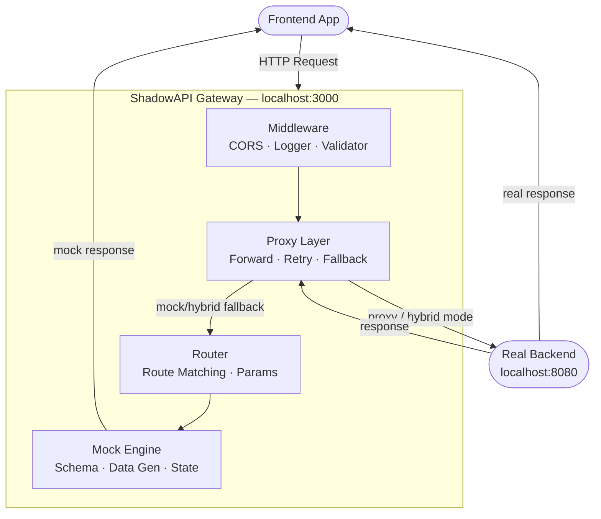
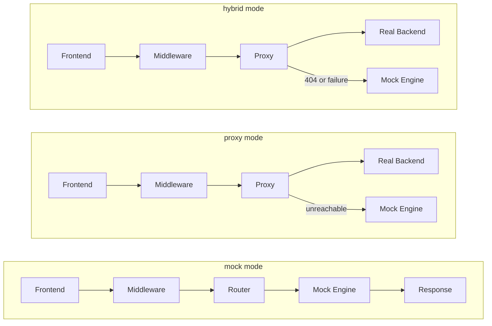
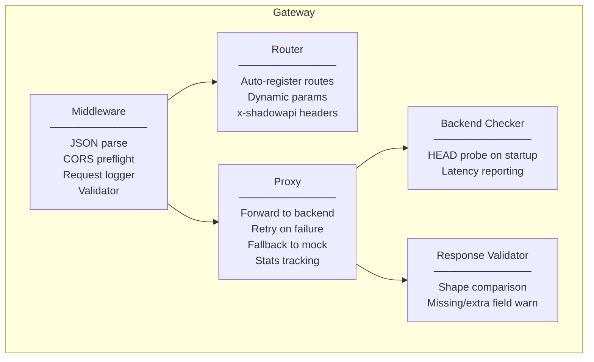

# ShadowAPI — Architecture

## System Overview



---

## Request Flow by Mode



---

## Component Breakdown



---

## Modes

| Mode     | Behaviour                                               |
|----------|---------------------------------------------------------|
| `mock`   | All requests served by mock engine                      |
| `proxy`  | All requests forwarded to real backend                  |
| `hybrid` | Tries real backend first, falls back to mock on failure |

---

## Configuration

`shadowapi.config.json`

```json
{
  "port": 3000,
  "mode": "mock",
  "contract": "openapi.yaml",
  "backend": "http://localhost:8080"
}
```

Override at runtime:

```bash
SHADOW_MODE=hybrid BACKEND_URL=http://localhost:8080 node gateway/server.js
```

---

## Key Endpoints

| Endpoint              | Description                               |
|-----------------------|-------------------------------------------|
| `GET /health`         | Gateway status + proxy stats              |
| `GET /gateway/status` | Backend health + uptime + route count     |
