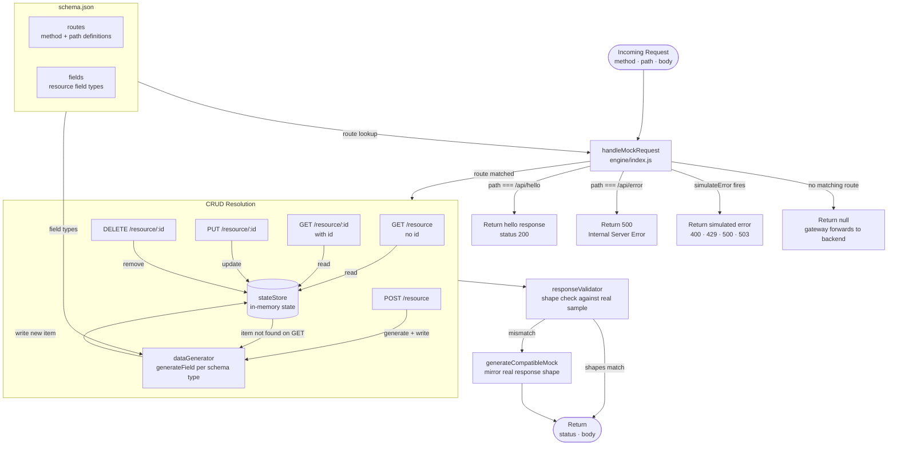
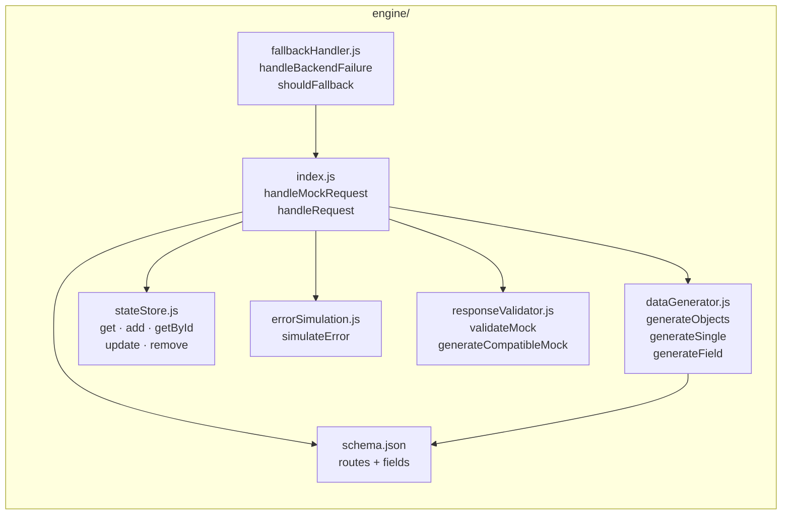
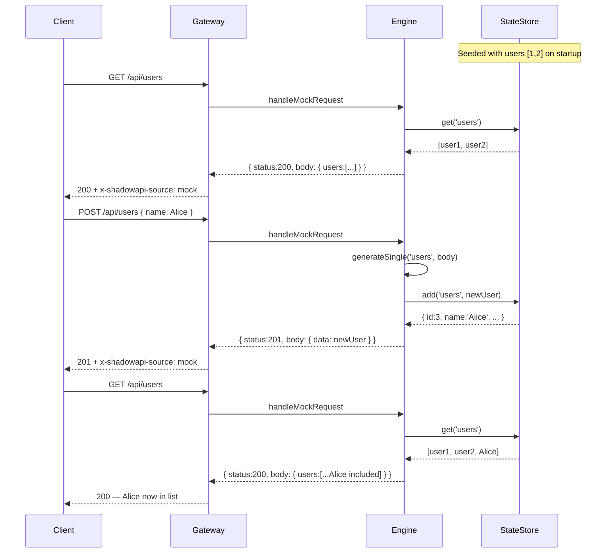
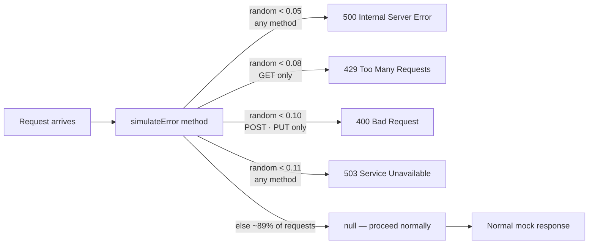
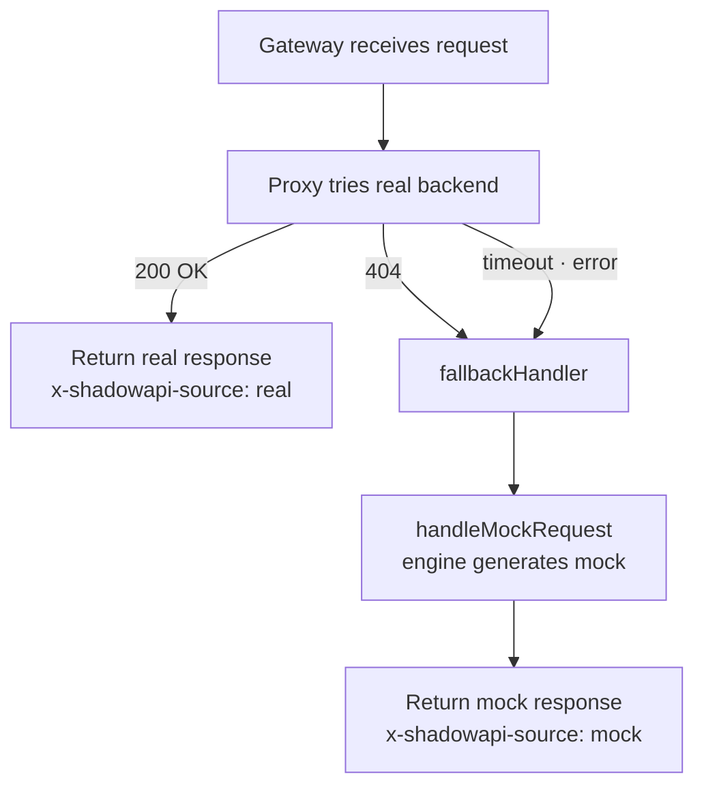

# ShadowAPI — Engine Data Flow

How data moves through the mock engine on every request.

---

## Full Request Data Flow

---

## Engine Internal Modules

---

## State Lifecycle

---

## Error Simulation Flow

---

## Fallback Flow (hybrid mode)

